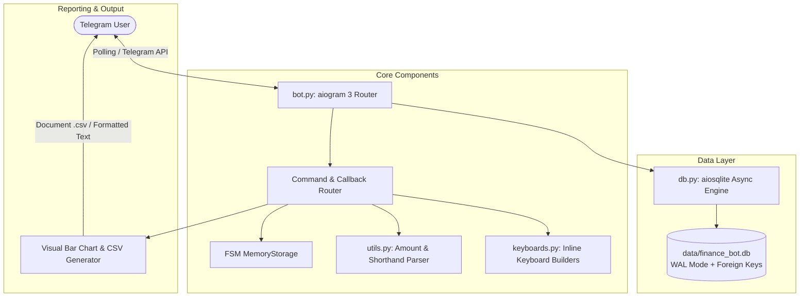
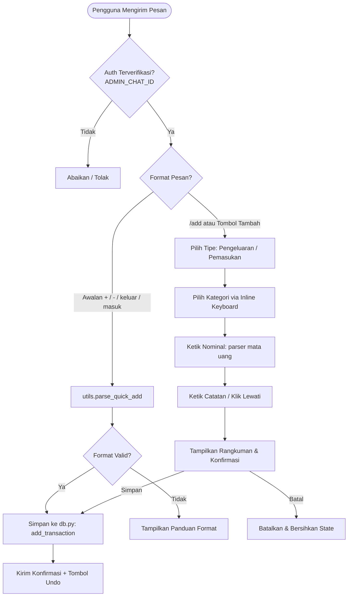
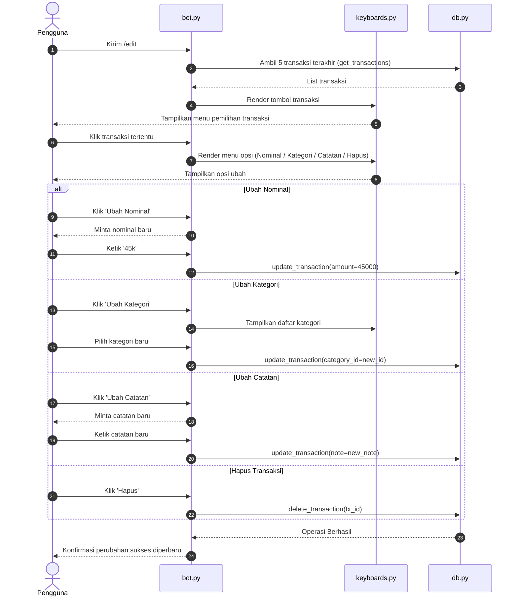
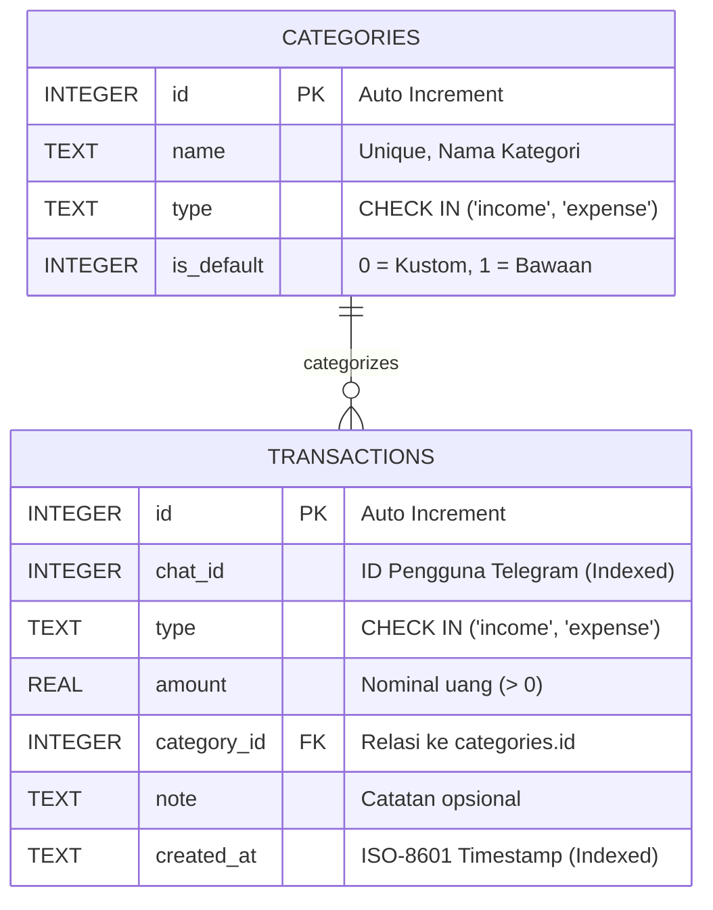

# 💰 Telegram Finance Tracker Bot: Notion Documentation

> 📌 **Document Status:** Complete & Verified  
> 🏷 **Owner:** Muhammad Rafli Pradipta  
> 📂 **Repository:** [Diptaaaa/bot_telegram_pencatatan_keuangan](https://github.com/Diptaaaa/bot_telegram_pencatatan_keuangan)  
> ⚙️ **Stack:** Python 3.12, aiogram 3.x, aiosqlite, SQLite (WAL Mode)  
> 📅 **Last Updated:** 2026-09-30  

---

## 📑 Daftar Isi

- [1. Ikhtisar Sistem](#1-ikhtisar-sistem)
- [2. Arsitektur & Alur Kerja](#2-arsitektur--alur-kerja)
  - [2.1 Diagram Arsitektur](#21-diagram-arsitektur)
  - [2.2 Alur Pencatatan (Quick-Add vs FSM Wizard)](#22-alur-pencatatan-quick-add-vs-fsm-wizard)
  - [2.3 Alur Edit & Koreksi Data](#23-alur-edit--koreksi-data)
- [3. Desain Basis Data (Database Schema)](#3-desain-basis-data-database-schema)
  - [3.1 Entity Relationship Diagram (ERD)](#31-entity-relationship-diagram-erd)
  - [3.2 Kamus Data (Data Dictionary)](#32-kamus-data-data-dictionary)
  - [3.3 Kategori Bawaan (Default Categories)](#33-kategori-bawaan-default-categories)
- [4. Matriks Perintah & Fitur](#4-matriks-perintah--fitur)
- [5. Rincian Modul Kode](#5-rincian-modul-kode)
- [6. Panduan Menjalankan Sistem (Operations & Deployment)](#6-panduan-menjalankan-sistem-operations--deployment)
  - [6.1 Menjalankan di Komputer Lokal](#61-menjalankan-di-komputer-lokal)
  - [6.2 Menjalankan di VPS (Linux Systemd)](#62-menjalankan-di-vps-linux-systemd)
  - [6.3 Prosedur Cadangan (Backup Database)](#63-prosedur-cadangan-backup-database)
- [7. Penanganan Masalah (Troubleshooting)](#7-penanganan-masalah-troubleshooting)

---

## 1. Ikhtisar Sistem

Finance Tracker Bot dirancang sebagai asisten keuangan pribadi yang beroperasi langsung di dalam Telegram. Fokus utama sistem ini adalah **kecepatan input** dan **kemudahan akses**: pengguna tidak perlu membuka aplikasi berat atau mengisi form panjang saat melakukan transaksi harian.

### Karakteristik Utama
- **Zero Cloud Database Dependency**: Menggunakan SQLite lokal dengan mode *Write-Ahead Logging* (WAL), sehingga data transaksi tersimpan utuh di perangkat pengguna tanpa risiko kebocoran ke server pihak ketiga.
- **Natural Language Parsing**: Mampu mengenali format nominal khas Indonesia seperti `50k`, `50rb`, `1.5jt`, dan `50.000`.
- **Dua Jalur Input**:
  1. *Quick-Add*: Input cepat satu baris (misal `- 25k nasi goreng`).
  2. *Interactive FSM Wizard*: Panduan tombol bertahap saat pengguna ingin memilih kategori spesifik.
- **Koreksi Kesalahan**: Tombol pembatalan instan (*Undo*) dan menu perbaikan transaksi (`/edit`).

---

## 2. Arsitektur & Alur Kerja

### 2.1 Diagram Arsitektur



---

### 2.2 Alur Pencatatan (Quick-Add vs FSM Wizard)



---

### 2.3 Alur Edit & Koreksi Data



---

## 3. Desain Basis Data (Database Schema)

Database menggunakan **SQLite 3** dengan integrasi asinkron melalui pustaka `aiosqlite`.

> 💡 **Optimasi Mesin Database:**
> - `PRAGMA journal_mode = WAL;`: Mengaktifkan *Write-Ahead Logging* untuk konkurensi pembacaan dan penulisan yang tinggi tanpa lock database.
> - `PRAGMA foreign_keys = ON;`: Memastikan integritas referensial antara transaksi dan kategori.
> - `PRAGMA busy_timeout = 5000;`: Menghindari galat *database locked* saat transaksi terjadi berturut-turut.

---

### 3.1 Entity Relationship Diagram (ERD)



---

### 3.2 Kamus Data (Data Dictionary)

#### Tabel: `categories`
| Kolom | Tipe Data | Constraint | Deskripsi |
| :--- | :--- | :--- | :--- |
| `id` | `INTEGER` | PRIMARY KEY AUTOINCREMENT | Identifier unik kategori |
| `name` | `TEXT` | NOT NULL UNIQUE | Nama kategori (misal: "Makanan", "Gaji") |
| `type` | `TEXT` | CHECK IN ('income', 'expense') | Menentukan kelompok kategori |
| `is_default` | `INTEGER` | DEFAULT 0 | 1 jika kategori sistem, 0 jika kategori buatan user |

#### Tabel: `transactions`
| Kolom | Tipe Data | Constraint | Deskripsi |
| :--- | :--- | :--- | :--- |
| `id` | `INTEGER` | PRIMARY KEY AUTOINCREMENT | Identifier unik transaksi |
| `chat_id` | `INTEGER` | NOT NULL | ID percakapan pengguna Telegram |
| `type` | `TEXT` | CHECK IN ('income', 'expense') | Tipe transaksi |
| `amount` | `REAL` | NOT NULL | Besaran uang |
| `category_id` | `INTEGER` | REFERENCES categories(id) | Kategori transaksi |
| `note` | `TEXT` | NULL | Catatan tambahan |
| `created_at` | `TEXT` | NOT NULL | Waktu transaksi dibuat (Format: `YYYY-MM-DD HH:MM:SS`) |

> 📌 **Indeks Database:**
> - `idx_transactions_chat_id` pada kolom `transactions(chat_id)` untuk mempercepat pencarian data milik akun spesifik.
> - `idx_transactions_created_at` pada kolom `transactions(created_at)` untuk mempercepat kalkulasi laporan bulanan dan mingguan.

---

### 3.3 Kategori Bawaan (Default Categories)

<details>
<summary><b>Klik untuk melihat daftar kategori awal sistem</b></summary>

- **Pengeluaran (`expense`):**
  - Makanan
  - Transportasi
  - Belanja
  - Tagihan
  - Hiburan
  - Kesehatan
  - Lainnya
- **Pemasukan (`income`):**
  - Gaji
  - Freelance
  - Investasi
  - Bonus
  - Pendapatan Lainnya

</details>

---

## 4. Matriks Perintah & Fitur

| Perintah | Tipe Interaksi | Deskripsi & Contoh |
| :--- | :--- | :--- |
| `/start` | Menu Utama | Menampilkan dashboard utama dan tombol akses cepat. |
| `/help` | Pesan Bantuan | Panduan lengkap cara input, shorthand, dan daftar perintah. |
| `/add` | FSM Wizard | Membuka panduan langkah demi langkah pencatatan transaksi. |
| `/history` | Navigasi Halaman | Menampilkan 5 transaksi terakhir per halaman lengkap dengan navigasi pagination. |
| `/edit` | Interactive Picker | Memilih transaksi tersimpan untuk diubah (nominal, kategori, atau catatan). |
| `/report` | Visual Dashboard | Menampilkan ringkasan keuangan mingguan/bulanan dengan diagram visual progres batang. |
| `/categories`| Manajemen Kategori| Melihat, menambah kategori baru, atau menghapus kategori non-sistem. |
| `/export` | File Output (.csv)| Mengunduh riwayat transaksi dalam berkas CSV berstandar UTF-8 with BOM untuk Microsoft Excel. |

---

## 5. Rincian Modul Kode

### 1. `bot.py`
Pusat pengendali dan logika bot:
- Mengelola state FSM (`AddTxStates` untuk wizard penambahan dan `EditTxStates` untuk wizard pengeditan).
- Menerapkan fungsi `check_auth(chat_id)` yang membaca variabel `ADMIN_CHAT_ID`. Jika variabel diisi, interaksi dari luar ID tersebut otomatis diabaikan.
- Menangkap pesan teks biasa untuk dialihkan ke `parse_quick_add`.

### 2. `db.py`
Lapisan abstraksi basis data (*Data Access Layer*):
- Mengisolasi seluruh query SQL (`SELECT`, `INSERT`, `UPDATE`, `DELETE`).
- Menggunakan parameterized queries (`?`) pada seluruh query untuk mencegah SQL Injection.
- Menyediakan fungsi agregasi laporan (`get_report`) yang mengelompokkan pengeluaran berdasarkan kategori serta menghitung total dan saldo bersih.

### 3. `keyboards.py`
Generator tampilan antarmuka interaktif:
- Menggunakan `InlineKeyboardBuilder` dari aiogram 3.
- Menyusun pagination dinamis untuk riwayat transaksi (`history_nav_kb`).
- Mengatur grid tombol kategori dan tombol konfirmasi/pembatalan.

### 4. `utils.py`
Modul utilitas dan alat bantu format:
- `parse_amount(text)`: Mengubah string input pengguna menjadi float valid. Menangani format desimal (`1.5jt`), akhiran ribuan (`k`, `rb`), jutaan (`jt`), dan format titik pemisah (`50.000`).
- `parse_quick_add(text, categories)`: Menangkap pola input kilat seperti `- 25k makan siang`, mencocokkan kata kunci kategori secara otomatis.
- `generate_progress_bar(percent)`: Membuat bar visual teks seperti `[██████░░░░] 60%`.
- `generate_csv(rows)`: Mengonversi baris transaksi menjadi CSV ber-BOM (`\ufeff`) agar kolom terbuka rapi tanpa masalah format pada Microsoft Excel.

### 5. `test_finance.py`
Suite pengujian unit (Automated Unit Tests):
- Memverifikasi fungsi parser nominal dan parser quick-add dengan berbagai kasus ekstrem.
- Memverifikasi operasi CRUD database dan fungsi edit transaksi.

---

## 6. Panduan Menjalankan Sistem (Operations & Deployment)

### 6.1 Menjalankan di Komputer Lokal

1. **Prasyarat:** Python versi 3.10 atau yang lebih baru.
2. **Setup Environment:**
   ```bash
   # Clone repositori
   git clone https://github.com/Diptaaaa/bot_telegram_pencatatan_keuangan.git
   cd bot_telegram_pencatatan_keuangan

   # Siapkan virtual environment
   python -m venv venv
   venv\Scripts\activate      # Untuk Windows
   # source venv/bin/activate # Untuk Linux/macOS

   # Pasang dependensi
   pip install -r requirements.txt
   ```
3. **Konfigurasi Berkas `.env`:**
   Salin dari template:
   ```env
   BOT_TOKEN=masukkan_token_bot_dari_botfather
   ADMIN_CHAT_ID=123456789
   ```
4. **Eksekusi:**
   ```bash
   python bot.py
   ```

---

### 6.2 Menjalankan di VPS (Linux Systemd)

Untuk menjalankan bot selama 24/7 tanpa henti pada server Linux (Ubuntu/Debian):

1. Masuk ke server via SSH dan letakkan berkas pada direktori `/root/finance-bot`.
2. Buat berkas konfigurasi systemd:
   ```bash
   sudo nano /etc/systemd/system/finance-bot.service
   ```
3. Masukkan konfigurasi berikut:
   ```ini
   [Unit]
   Description=Finance Tracker Telegram Bot
   After=network.target

   [Service]
   Type=simple
   User=root
   WorkingDirectory=/root/finance-bot
   ExecStart=/root/finance-bot/venv/bin/python bot.py
   Restart=always
   RestartSec=5

   [Install]
   WantedBy=multi-user.target
   ```
4. Aktifkan dan jalankan service:
   ```bash
   sudo systemctl daemon-reload
   sudo systemctl enable finance-bot
   sudo systemctl start finance-bot
   ```
5. Pantau status dan log bot:
   ```bash
   sudo systemctl status finance-bot
   journalctl -u finance-bot -f
   ```

---

### 6.3 Prosedur Cadangan (Backup Database)

Karena seluruh data tersimpan dalam satu berkas di `data/finance_bot.db`, proses pencadangan sangat sederhana:
- Cukup salin berkas `data/finance_bot.db` ke tempat penyimpanan cadangan secara berkala.
- Mode WAL menjamin berkas dapat disalin secara aman tanpa mematikan bot terlebih dahulu.

---

## 7. Penanganan Masalah (Troubleshooting)

<details>
<summary><b>1. Bot tidak merespons pesan sama sekali</b></summary>

- **Periksa log console:** Pastikan tidak ada galat token salah (`aiogram.exceptions.TelegramUnauthorizedError`).
- **Periksa filter ADMIN_CHAT_ID:** Jika Anda mengisi `ADMIN_CHAT_ID` di berkas `.env`, pastikan ID Telegram Anda cocok. Jika ingin bot merespons semua orang, kosongkan nilai tersebut.
</details>

<details>
<summary><b>2. Format CSV berantakan saat dibuka di Excel</b></summary>

- Sistem sudah menyertakan UTF-8 BOM (`\ufeff`). Jika Excel versi lama Anda memisahkan kolom dengan titik-koma alih-alih koma, buka Excel $\rightarrow$ Data $\rightarrow$ From Text/CSV dan pilih delimiter koma (`,`).
</details>

<details>
<summary><b>3. Muncul galat 'Database is locked'</b></summary>

- Sistem sudah mengaktifkan `busy_timeout = 5000` dan mode WAL. Galat ini biasanya hanya muncul bila berkas database dibuka oleh aplikasi GUI lain (seperti DB Browser for SQLite) dalam mode penguncian eksklusif (*exclusive lock*). Tutup aplikasi pembuka database tersebut.
</details>
